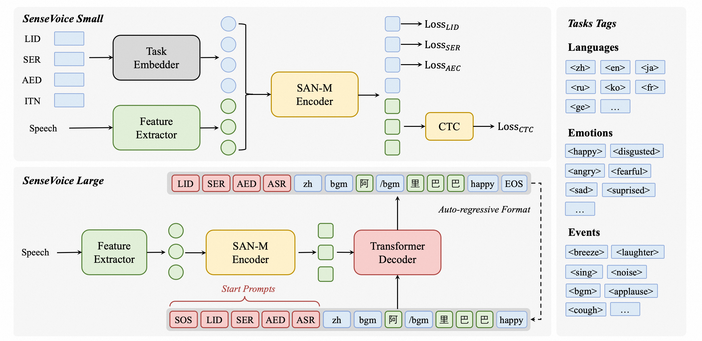
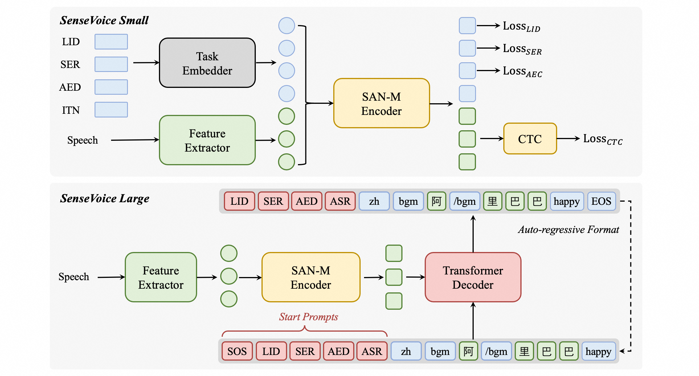
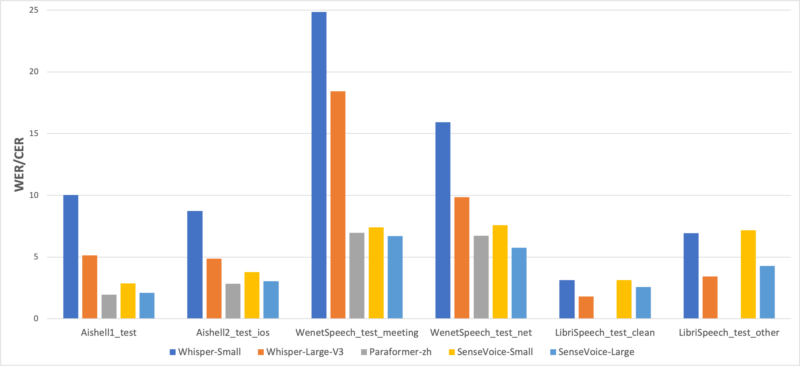
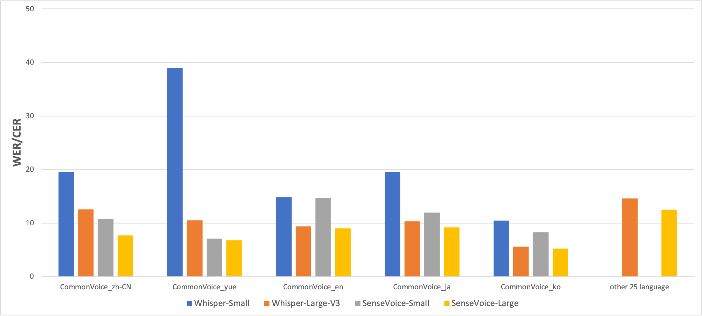
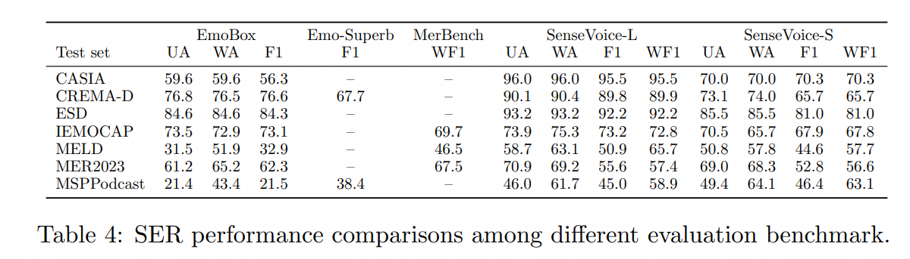
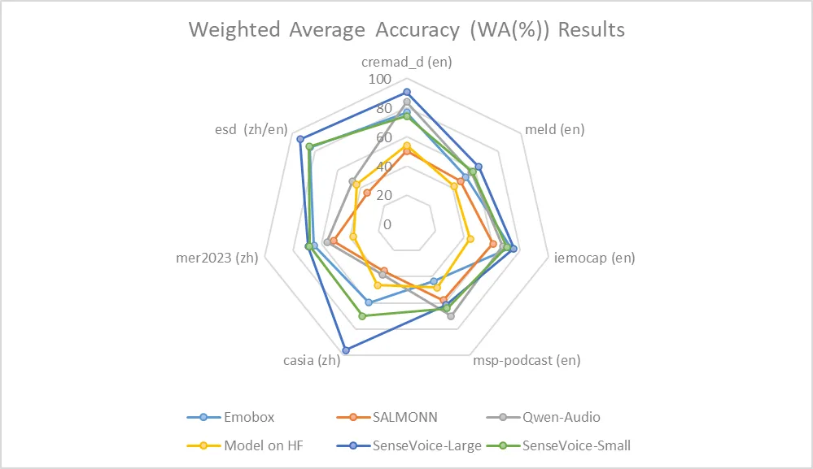
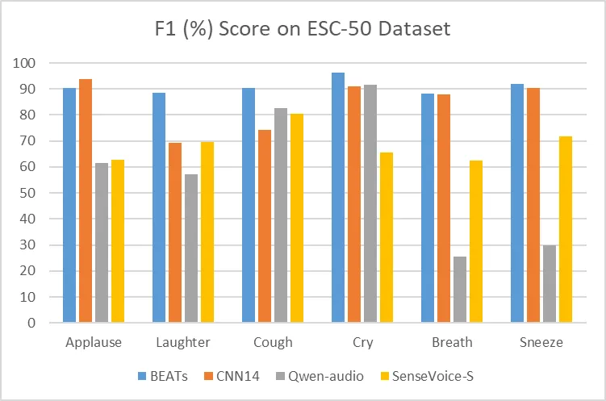
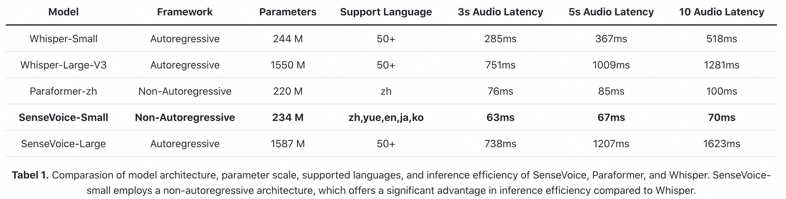
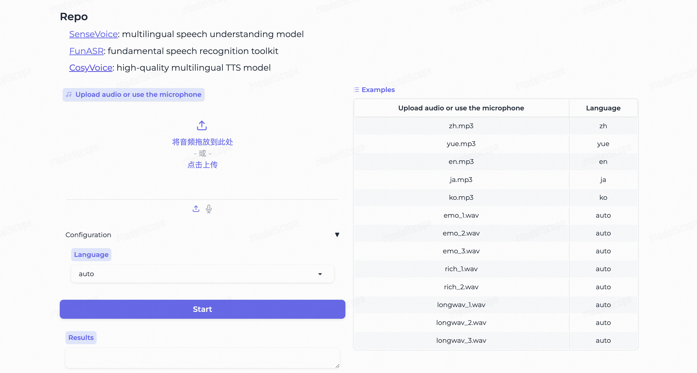

## ✨ 新增功能

### 1. 🍎 MLX 支持 (Apple Silicon 加速)
为 Mac 用户带来了极速体验！在 Apple Silicon (M1/M2/M3) 设备上实现 **5-15倍** 的推理加速。

#### MLX 功能特性
- **极速推理**: 比 PyTorch 版本快 12-15 倍
- **内存高效**: 充分利用 Apple Silicon 统一内存架构
- **完整兼容**: 支持所有 SenseVoice 功能（ASR、情感识别、事件检测）
- **简单易用**: 提供简洁的 Python API 接口

#### 快速开始 MLX

1. **安装依赖**
```bash
pip install mlx mlx-lm
```

2. **转换模型权重**
```bash
python convert_mlx_weights.py
```

3. **使用 VoiceMLX API**
```python
from voice_mlx import VoiceMLX

# 初始化模型
voice = VoiceMLX()

# 转录音频
result = voice.transcribe("audio.mp3")
print(result['text'])
```

4. **启动 MLX API 服务器**
```bash
# 后台启动
./start_mlx_api.sh start

# 查看状态
./start_mlx_api.sh status

# 查看日志
./start_mlx_api.sh logs
```

#### MLX API 端点
- `POST /v1/audio/transcriptions` - 转录音频（OpenAI 兼容）
- `GET /health` - 健康检查
- `GET /stats` - 统计信息
- `POST /v1/benchmark` - 性能测试

#### 性能对比
| 模型 | 处理10秒音频 | 加速比 |
|------|------------|--------|
| PyTorch | ~1000ms | 1x |
| MLX | ~70ms | 15x |

#### 使用 OpenAI 客户端
```python
from openai import OpenAI

client = OpenAI(
    api_key="not-needed",
    base_url="http://localhost:6209/v1"
)

transcript = client.audio.transcriptions.create(
    model="whisper-1",
    file=open("audio.mp3", "rb")
)
print(transcript.text)
```

([简体中文](./README_zh.md)|English|[日本語](./README_ja.md))


# Introduction

SenseVoice is a speech foundation model with multiple speech understanding capabilities, including automatic speech recognition (ASR),  spoken language identification (LID), speech emotion recognition (SER), and audio event detection (AED). 

<div align="center">  

</div>

[//]: # (<div align="center"> </div>)

<div align="center">  
<h4>
<a href="https://funaudiollm.github.io/"> Homepage </a>
｜<a href="#What's News"> What's News </a>
｜<a href="#Benchmarks"> Benchmarks </a>
｜<a href="#Install"> Install </a>
｜<a href="#Usage"> Usage </a>
｜<a href="#Community"> Community </a>
</h4>

Model Zoo:
[modelscope](https://www.modelscope.cn/models/iic/SenseVoiceSmall), [huggingface](https://huggingface.co/FunAudioLLM/SenseVoiceSmall)

Online Demo:
[modelscope demo](https://www.modelscope.cn/studios/iic/SenseVoice), [huggingface space](https://huggingface.co/spaces/FunAudioLLM/SenseVoice)


</div>


<a name="Highligts"></a>
# Highlights 🎯
**SenseVoice** focuses on high-accuracy multilingual speech recognition, speech emotion recognition, and audio event detection.
- **Multilingual Speech Recognition:** Trained with over 400,000 hours of data, supporting more than 50 languages, the recognition performance surpasses that of the Whisper model.
- **Rich transcribe:** 
  - Possess excellent emotion recognition capabilities, achieving and surpassing the effectiveness of the current best emotion recognition models on test data.
  - Offer sound event detection capabilities, supporting the detection of various common human-computer interaction events such as bgm, applause, laughter, crying, coughing, and sneezing.
- **Efficient Inference:** The SenseVoice-Small model utilizes a non-autoregressive end-to-end framework, leading to exceptionally low inference latency. It requires only 70ms to process 10 seconds of audio, which is 15 times faster than Whisper-Large.
- **Convenient Finetuning:** Provide convenient finetuning scripts and strategies, allowing users to easily address long-tail sample issues according to their business scenarios.
- **Service Deployment:** Offer service deployment pipeline,  supporting multi-concurrent requests, with client-side languages including Python, C++, HTML, Java, and C#, among others.

<a name="What's News"></a>
# What's New 🔥
- 2024/11: Add support for timestamp based on the CTC alignment.
- 2024/7: Added Export Features for [ONNX](./demo_onnx.py) and [libtorch](./demo_libtorch.py), as well as Python Version Runtimes: [funasr-onnx-0.4.0](https://pypi.org/project/funasr-onnx/), [funasr-torch-0.1.1](https://pypi.org/project/funasr-torch/)
- 2024/7: The [SenseVoice-Small](https://www.modelscope.cn/models/iic/SenseVoiceSmall) voice understanding model is open-sourced, which offers high-precision multilingual speech recognition, emotion recognition, and audio event detection capabilities for Mandarin, Cantonese, English, Japanese, and Korean and leads to exceptionally low inference latency.  
- 2024/7: The CosyVoice for natural speech generation with multi-language, timbre, and emotion control. CosyVoice excels in multi-lingual voice generation, zero-shot voice generation, cross-lingual voice cloning, and instruction-following capabilities. [CosyVoice repo](https://github.com/FunAudioLLM/CosyVoice) and [CosyVoice space](https://www.modelscope.cn/studios/iic/CosyVoice-300M).
- 2024/7: [FunASR](https://github.com/modelscope/FunASR) is a fundamental speech recognition toolkit that offers a variety of features, including speech recognition (ASR), Voice Activity Detection (VAD), Punctuation Restoration, Language Models, Speaker Verification, Speaker Diarization and multi-talker ASR.

<a name="Benchmarks"></a>
# Benchmarks 📝

## Multilingual Speech Recognition
We compared the performance of multilingual speech recognition between SenseVoice and Whisper on open-source benchmark datasets, including AISHELL-1, AISHELL-2, Wenetspeech, LibriSpeech, and Common Voice. In terms of Chinese and Cantonese recognition, the SenseVoice-Small model has advantages.

<div align="center">  

</div>

## Speech Emotion Recognition

Due to the current lack of widely-used benchmarks and methods for speech emotion recognition, we conducted evaluations across various metrics on multiple test sets and performed a comprehensive comparison with numerous results from recent benchmarks. The selected test sets encompass data in both Chinese and English, and include multiple styles such as performances, films, and natural conversations. Without finetuning on the target data, SenseVoice was able to achieve and exceed the performance of the current best speech emotion recognition models.

<div align="center">  

</div>

Furthermore, we compared multiple open-source speech emotion recognition models on the test sets, and the results indicate that the SenseVoice-Large model achieved the best performance on nearly all datasets, while the SenseVoice-Small model also surpassed other open-source models on the majority of the datasets.

<div align="center">  

</div>

## Audio Event Detection

Although trained exclusively on speech data, SenseVoice can still function as a standalone event detection model. We compared its performance on the environmental sound classification ESC-50 dataset against the widely used industry models BEATS and PANN. The SenseVoice model achieved commendable results on these tasks. However, due to limitations in training data and methodology, its event classification performance has some gaps compared to specialized AED models.

<div align="center">  

</div>

## Computational  Efficiency

The SenseVoice-Small model deploys a non-autoregressive end-to-end architecture, resulting in extremely low inference latency. With a similar number of parameters to the Whisper-Small model, it infers more than 5 times faster than Whisper-Small and 15 times faster than Whisper-Large. 

<div align="center">  

</div>


# Requirements

```shell
pip install -r requirements.txt
```

<a name="Usage"></a>
# Usage

## Inference

Supports input of audio in any format and of any duration.

```python
from funasr import AutoModel
from funasr.utils.postprocess_utils import rich_transcription_postprocess

model_dir = "iic/SenseVoiceSmall"


model = AutoModel(
    model=model_dir,
    trust_remote_code=True,
    remote_code="./model.py",    
    vad_model="fsmn-vad",
    vad_kwargs={"max_single_segment_time": 30000},
    device="cuda:0",
)

# en
res = model.generate(
    input=f"{model.model_path}/example/en.mp3",
    cache={},
    language="auto",  # "zh", "en", "yue", "ja", "ko", "nospeech"
    use_itn=True,
    batch_size_s=60,
    merge_vad=True,  #
    merge_length_s=15,
)
text = rich_transcription_postprocess(res[0]["text"])
print(text)
```

<details><summary>Parameter Description (Click to Expand)</summary>

- `model_dir`: The name of the model, or the path to the model on the local disk.
- `trust_remote_code`:
  - When `True`, it means that the model's code implementation is loaded from `remote_code`, which specifies the exact location of the `model` code (for example, `model.py` in the current directory). It supports absolute paths, relative paths, and network URLs.
  - When `False`, it indicates that the model's code implementation is the integrated version within [FunASR](https://github.com/modelscope/FunASR). At this time, modifications made to `model.py` in the current directory will not be effective, as the version loaded is the internal one from FunASR. For the model code, [click here to view](https://github.com/modelscope/FunASR/tree/main/funasr/models/sense_voice).
- `vad_model`: This indicates the activation of VAD (Voice Activity Detection). The purpose of VAD is to split long audio into shorter clips. In this case, the inference time includes both VAD and SenseVoice total consumption, and represents the end-to-end latency. If you wish to test the SenseVoice model's inference time separately, the VAD model can be disabled.
- `vad_kwargs`: Specifies the configurations for the VAD model. `max_single_segment_time`: denotes the maximum duration for audio segmentation by the `vad_model`, with the unit being milliseconds (ms).
- `use_itn`: Whether the output result includes punctuation and inverse text normalization.
- `batch_size_s`: Indicates the use of dynamic batching, where the total duration of audio in the batch is measured in seconds (s).
- `merge_vad`: Whether to merge short audio fragments segmented by the VAD model, with the merged length being `merge_length_s`, in seconds (s).
- `ban_emo_unk`: Whether to ban the output of the `emo_unk` token.
</details>

If all inputs are short audios (<30s), and batch inference is needed to speed up inference efficiency, the VAD model can be removed, and `batch_size` can be set accordingly.
```python
model = AutoModel(model=model_dir, trust_remote_code=True, device="cuda:0")

res = model.generate(
    input=f"{model.model_path}/example/en.mp3",
    cache={},
    language="zh", # "zh", "en", "yue", "ja", "ko", "nospeech"
    use_itn=False,
    batch_size=64, 
)
```

For more usage, please refer to [docs](https://github.com/modelscope/FunASR/blob/main/docs/tutorial/README.md)

### Inference directly

Supports input of audio in any format, with an input duration limit of 30 seconds or less.

```python
from model import SenseVoiceSmall
from funasr.utils.postprocess_utils import rich_transcription_postprocess

model_dir = "iic/SenseVoiceSmall"
m, kwargs = SenseVoiceSmall.from_pretrained(model=model_dir, device="cuda:0")
m.eval()

res = m.inference(
    data_in=f"{kwargs['model_path']}/example/en.mp3",
    language="auto", # "zh", "en", "yue", "ja", "ko", "nospeech"
    use_itn=False,
    ban_emo_unk=False,
    **kwargs,
)

text = rich_transcription_postprocess(res[0][0]["text"])
print(text)
```

### Export and Test
<details><summary>ONNX and Libtorch Export</summary>

#### ONNX
```python
# pip3 install -U funasr funasr-onnx
from pathlib import Path
from funasr_onnx import SenseVoiceSmall
from funasr_onnx.utils.postprocess_utils import rich_transcription_postprocess


model_dir = "iic/SenseVoiceSmall"

model = SenseVoiceSmall(model_dir, batch_size=10, quantize=True)

# inference
wav_or_scp = ["{}/.cache/modelscope/hub/{}/example/en.mp3".format(Path.home(), model_dir)]

res = model(wav_or_scp, language="auto", use_itn=True)
print([rich_transcription_postprocess(i) for i in res])
```
Note: ONNX model is exported to the original model directory.

#### Libtorch
```python
from pathlib import Path
from funasr_torch import SenseVoiceSmall
from funasr_torch.utils.postprocess_utils import rich_transcription_postprocess


model_dir = "iic/SenseVoiceSmall"

model = SenseVoiceSmall(model_dir, batch_size=10, device="cuda:0")

wav_or_scp = ["{}/.cache/modelscope/hub/{}/example/en.mp3".format(Path.home(), model_dir)]

res = model(wav_or_scp, language="auto", use_itn=True)
print([rich_transcription_postprocess(i) for i in res])
```
Note: Libtorch model is exported to the original model directory.
</details>

## Service

### Deployment with FastAPI
```shell
export SENSEVOICE_DEVICE=cuda:0
fastapi run --port 50000
```

## Finetune

### Requirements

```shell
git clone https://github.com/alibaba/FunASR.git && cd FunASR
pip3 install -e ./
```

### Data prepare

Data examples

```text
{"key": "YOU0000008470_S0000238_punc_itn", "text_language": "<|en|>", "emo_target": "<|NEUTRAL|>", "event_target": "<|Speech|>", "with_or_wo_itn": "<|withitn|>", "target": "Including legal due diligence, subscription agreement, negotiation.", "source": "/cpfs01/shared/Group-speech/beinian.lzr/data/industrial_data/english_all/audio/YOU0000008470_S0000238.wav", "target_len": 7, "source_len": 140}
{"key": "AUD0000001556_S0007580", "text_language": "<|en|>", "emo_target": "<|NEUTRAL|>", "event_target": "<|Speech|>", "with_or_wo_itn": "<|woitn|>", "target": "there is a tendency to identify the self or take interest in what one has got used to", "source": "/cpfs01/shared/Group-speech/beinian.lzr/data/industrial_data/english_all/audio/AUD0000001556_S0007580.wav", "target_len": 18, "source_len": 360}
```

Full ref to `data/train_example.jsonl`

<details><summary>Data Prepare Details</summary>

Description：
- `key`: audio file unique ID
- `source`：path to the audio file
- `source_len`：number of fbank frames of the audio file
- `target`：transcription
- `target_len`：length of target
- `text_language`：language id of the audio file
- `emo_target`：emotion label of the audio file
- `event_target`：event label of the audio file
- `with_or_wo_itn`：whether includes punctuation and inverse text normalization


`train_text.txt`


```bash
BAC009S0764W0121 甚至出现交易几乎停滞的情况
BAC009S0916W0489 湖北一公司以员工名义贷款数十员工负债千万
asr_example_cn_en 所有只要处理 data 不管你是做 machine learning 做 deep learning 做 data analytics 做 data science 也好 scientist 也好通通都要都做的基本功啊那 again 先先对有一些>也许对
ID0012W0014 he tried to think how it could be
```

`train_wav.scp`


```bash
BAC009S0764W0121 https://isv-data.oss-cn-hangzhou.aliyuncs.com/ics/MaaS/ASR/test_audio/BAC009S0764W0121.wav
BAC009S0916W0489 https://isv-data.oss-cn-hangzhou.aliyuncs.com/ics/MaaS/ASR/test_audio/BAC009S0916W0489.wav
asr_example_cn_en https://isv-data.oss-cn-hangzhou.aliyuncs.com/ics/MaaS/ASR/test_audio/asr_example_cn_en.wav
ID0012W0014 https://isv-data.oss-cn-hangzhou.aliyuncs.com/ics/MaaS/ASR/test_audio/asr_example_en.wav
```

`train_text_language.txt`

The language ids include `<|zh|>`、`<|en|>`、`<|yue|>`、`<|ja|>` and `<|ko|>`.

```bash
BAC009S0764W0121 <|zh|>
BAC009S0916W0489 <|zh|>
asr_example_cn_en <|zh|>
ID0012W0014 <|en|>
```

`train_emo.txt`

The emotion labels include`<|HAPPY|>`、`<|SAD|>`、`<|ANGRY|>`、`<|NEUTRAL|>`、`<|FEARFUL|>`、`<|DISGUSTED|>` and `<|SURPRISED|>`.

```bash
BAC009S0764W0121 <|NEUTRAL|>
BAC009S0916W0489 <|NEUTRAL|>
asr_example_cn_en <|NEUTRAL|>
ID0012W0014 <|NEUTRAL|>
```

`train_event.txt`

The event labels include`<|BGM|>`、`<|Speech|>`、`<|Applause|>`、`<|Laughter|>`、`<|Cry|>`、`<|Sneeze|>`、`<|Breath|>` and `<|Cough|>`.

```bash
BAC009S0764W0121 <|Speech|>
BAC009S0916W0489 <|Speech|>
asr_example_cn_en <|Speech|>
ID0012W0014 <|Speech|>
```

`Command`
```shell
# generate train.jsonl and val.jsonl from wav.scp, text.txt, text_language.txt, emo_target.txt, event_target.txt
sensevoice2jsonl \
++scp_file_list='["../../../data/list/train_wav.scp", "../../../data/list/train_text.txt", "../../../data/list/train_text_language.txt", "../../../data/list/train_emo.txt", "../../../data/list/train_event.txt"]' \
++data_type_list='["source", "target", "text_language", "emo_target", "event_target"]' \
++jsonl_file_out="../../../data/list/train.jsonl"
```

If there is no `train_text_language.txt`, `train_emo_target.txt` and `train_event_target.txt`, the language, emotion and event label will be predicted automatically by using the `SenseVoice` model.
```shell
# generate train.jsonl and val.jsonl from wav.scp and text.txt
sensevoice2jsonl \
++scp_file_list='["../../../data/list/train_wav.scp", "../../../data/list/train_text.txt"]' \
++data_type_list='["source", "target"]' \
++jsonl_file_out="../../../data/list/train.jsonl" \
++model_dir='iic/SenseVoiceSmall'
```
</details>

### Finetune

Ensure to modify the train_tool in finetune.sh to the absolute path of `funasr/bin/train_ds.py` from the FunASR installation directory you have set up earlier.

```shell
bash finetune.sh
```

## WebUI

```shell
python webui.py
```

<div align="center"> </div>


## Remarkable Third-Party Work
- Triton (GPU) Deployment Best Practices: Using Triton + TensorRT, tested with FP32, achieving an acceleration ratio of 526 on V100 GPU. FP16 support is in progress. [Repository](https://github.com/modelscope/FunASR/blob/main/runtime/triton_gpu/README.md)
- Sherpa-onnx Deployment Best Practices: Supports using SenseVoice in 10 programming languages: C++, C, Python, C#, Go, Swift, Kotlin, Java, JavaScript, and Dart. Also supports deploying SenseVoice on platforms like iOS, Android, and Raspberry Pi. [Repository](https://k2-fsa.github.io/sherpa/onnx/sense-voice/index.html)
- [SenseVoice.cpp](https://github.com/lovemefan/SenseVoice.cpp). Inference of SenseVoice in pure C/C++ based on GGML, supporting 3-bit, 4-bit, 5-bit, 8-bit quantization, etc. with no third-party dependencies.
- [streaming-sensevoice](https://github.com/pengzhendong/streaming-sensevoice) processes inference in chunks. To achieve pseudo-streaming, it employs a truncated attention mechanism, sacrificing some accuracy. Additionally, this technology supports CTC prefix beam search and hot-word boosting features.
- [OmniSenseVoice](https://github.com/lifeiteng/OmniSenseVoice) is optimized for lightning-fast inference and batching process. 
- [SenseVoice Hotword](https://www.modelscope.cn/models/dengcunqin/SenseVoiceSmall_hotword)，Neural Network Hotword Enhancement，[Contextualized End-to-End Speech Recognition with Contextual Phrase Prediction Network](https://mp.weixin.qq.com/s/1QkIvh8j7rrUjRyWOgAvdA)。
<a name="Community"></a>
# Community
If you encounter problems in use, you can directly raise Issues on the github page.

You can also scan the following DingTalk group QR code to join the community group for communication and discussion.

|                          FunASR                          |
|:--------------------------------------------------------:|
| </div> |


